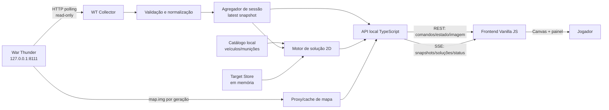

# PRD / Design Doc — Protótipo de Interface de Artilharia para War Thunder

| Campo | Valor |
|---|---|
| Status | Proposta pronta para spike técnico e validação |
| Versão | 1.0 |
| Data | 2026-09-04 |
| Plataforma-alvo | Windows, navegador local em monitor principal ou secundário |
| Backend | Node.js + TypeScript |
| Frontend | HTML5 + CSS3 + JavaScript Vanilla (ES Modules) |
| Fonte primária de telemetria | `http://127.0.0.1:8111` |

## 1. Resumo executivo

O projeto criará um protótipo funcional, local e somente leitura de uma interface de direção de tiro de artilharia. O cliente exibirá o mapa tático fornecido pelo War Thunder, acompanhará a posição e o rumo do veículo do jogador, permitirá manter até oito pontos de mira simultâneos e calculará, em tempo real, distância e azimute de mapa para cada ponto.

A experiência visual combinará a clareza operacional do `wt-tools.app` — mapa dominante, controles compactos e leitura numérica imediata — com padrões de apresentação inspirados em sistemas modernos de SPAAG/SAM já familiares ao jogador: alvos numerados, estado de seleção evidente, simbologia de alto contraste, vetores de direção, anéis de alcance e painel de pistas/alvos.

O sistema terá três limites deliberados:

1. Não automatizará mira, torre, disparo ou qualquer entrada no jogo.
2. Não lerá memória, arquivos internos, frames renderizados ou processos do jogo; usará apenas o serviço HTTP local exposto na porta `8111`.
3. Não prometerá dados que a API não fornece. O contrato documentado permite obter mapa, posição e, em observações atuais, o identificador interno do veículo. Ele não fornece de forma confiável a identidade da munição selecionada, propriedades explosivas, elevação do terreno ou uma solução balística tridimensional. O MVP usará um catálogo local de munições e seleção manual explícita sempre que a telemetria não puder identificar a munição.

## 2. Problema e oportunidade

Veículos com capacidade de fogo indireto podem ser utilizados de forma improvisada, mas o jogo não apresenta uma interface dedicada que converta marcações do mapa em dados de direção de tiro. O jogador precisa estimar escala, distância e orientação, frequentemente usando ferramentas separadas e fluxos manuais.

O protótipo deve demonstrar como uma mecânica oficial poderia:

- aproveitar o mapa e a simbologia já conhecidos pelo jogador;
- apresentar múltiplas missões de tiro sem poluir a tela;
- reduzir trabalho mecânico de medição, mantendo a decisão e a execução com o jogador;
- representar alcance e área de efeito da munição de modo transparente;
- servir como prova de conceito para discussão com a desenvolvedora, sem se passar por recurso oficial.

## 3. Objetivos, não objetivos e métricas

### 3.1 Objetivos do MVP

- Conectar automaticamente ao serviço local do War Thunder quando uma partida ou sessão compatível estiver ativa.
- Renderizar o mapa atual e acompanhar a posição do jogador com atualização visual de pelo menos 5 Hz.
- Permitir criar, selecionar, mover, renomear, reordenar e remover de um a oito pontos de mira.
- Calcular para cada ponto:
  - distância horizontal 2D em metros;
  - azimute de mapa em graus, com `0° = norte`, `90° = leste`, `180° = sul` e `270° = oeste`;
  - diferença angular relativa ao rumo do veículo, quando `dx/dy` estiverem disponíveis;
  - área de efeito configurada da munição, quando houver perfil confiável.
- Mostrar claramente se veículo e munição vieram da telemetria, de seleção manual ou estão desconhecidos.
- Continuar funcional em modo de demonstração com fixtures, mesmo sem o jogo em execução.

### 3.2 Não objetivos do MVP

- Calcular elevação do canhão, tempo de voo, deriva, resistência do ar, vento, temperatura de propelente ou correção por terreno.
- Produzir uma solução de tiro 3D ou garantir ponto de impacto real.
- Controlar o jogo, movimentar cursor, alterar mira, ajustar distância ou disparar.
- Exibir ou rastrear automaticamente inimigos recebidos em `/map_obj.json`.
- Executar como ESP, modificar a interface do jogo ou sobrepor marcadores a alvos na visão 3D.
- Ler memória, pacotes de rede, arquivos/datamines do cliente em tempo de execução ou fazer OCR da tela.
- Sincronizar alvos entre jogadores ou enviar telemetria para a nuvem.
- Identificar nominalmente o mapa quando a API não fornecer esse dado.

### 3.3 Métricas de sucesso

| Métrica | Meta do protótipo |
|---|---:|
| Tempo entre API disponível e mapa operacional | até 2 s |
| Frequência visual de posição/soluções | pelo menos 5 Hz |
| Latência p95 entre amostra e UI local | até 350 ms |
| Erro relativo do cálculo sintético de distância | menor que `1e-9` na unidade usada |
| Erro do cálculo sintético de azimute | menor que 0,1° |
| Pontos simultâneos | 8 |
| Sessão contínua sem erro não tratado | 30 min |
| Sucesso em teste de usabilidade: criar dois alvos e ler solução | 90% sem ajuda |

As metas matemáticas validam a implementação, não a precisão de campo. A precisão prática continua limitada pela resolução do clique, pelos metadados do mapa, pela calibração “unidade de mundo → metro” e pela ausência de elevação/terreno. O sufixo `m` só será usado para uma assinatura/modo de mapa cuja escala tenha sido validada; antes disso, a UI mostrará `u.m.` (unidades de mapa) e um aviso de calibração.

## 4. Usuários e cenários

### 4.1 Persona principal

Jogador experiente de batalhas terrestres, usando um veículo capaz de fogo indireto e um monitor principal ou secundário. Conhece azimute e distância, mas não deve precisar conhecer o contrato da API 8111.

### 4.2 Cenários prioritários

1. **Preparar uma missão de tiro:** o jogador abre o cliente, confirma veículo/munição, marca um ponto e lê distância/azimute.
2. **Manter uma lista de alvos:** o jogador marca vários pontos, alterna o alvo ativo pelas teclas `1–8` e compara as soluções.
3. **Reposicionar o veículo:** os alvos permanecem fixos no mapa; distância, azimute e indicação esquerda/direita são recalculados conforme o jogador se move.
4. **Trocar munição:** o jogador escolhe outro perfil e visualiza imediatamente o novo alcance permitido e a nova área de efeito.
5. **Perder conexão:** a interface conserva a última leitura, marca-a como obsoleta e se recupera sem recarregar a página.
6. **Trocar de partida/mapa:** os alvos anteriores são invalidados para impedir o uso de coordenadas pertencentes a outro mapa.

## 5. Escopo funcional

### 5.1 Prioridade P0 — necessária para o MVP

| ID | Requisito | Critério resumido |
|---|---|---|
| RF-01 | Descoberta de sessão | Detectar online, aguardando partida, inválido e desconectado. |
| RF-02 | Mapa ao vivo | Carregar `/map.img`, respeitar proporção e recarregar quando a geração mudar. |
| RF-03 | Posição do jogador | Localizar o objeto com `icon: "Player"` e atualizar marcador/rumo. |
| RF-04 | Múltiplos pontos | Suportar 1–8 pontos, IDs estáveis `T1…T8` e seleção independente. |
| RF-05 | Solução 2D | Recalcular distância e azimute a cada nova posição ou edição do alvo. |
| RF-06 | Painel de alvos | Exibir ID, rótulo, distância, azimute, correção relativa e estado de alcance. |
| RF-07 | Veículo | Resolver `indicators.type`; oferecer seleção manual se ausente/desconhecido. |
| RF-08 | Munição | Usar identidade telemétrica apenas se campo explícito for validado; caso contrário exigir seleção manual. |
| RF-09 | Área de efeito | Desenhar raio configurado e mostrar a fonte/confiança do perfil. |
| RF-10 | Resiliência | Não apagar a tela em falha transitória; mostrar idade do último dado válido. |
| RF-11 | Modo demo | Reproduzir mapa sintético e timeline determinística sem War Thunder. |
| RF-12 | Anéis de alcance | Exibir/ocultar quatro anéis proporcionais à escala disponível. |

### 5.2 Prioridade P1 — após o MVP

- Configuração da quantidade e do espaçamento dos anéis de alcance.
- Alternância entre orientação norte-acima e jogador-acima.
- Atalhos completos de teclado e suporte a toque.
- Importação/exportação local de uma lista de alvos em JSON.
- Perfis por veículo com limites de travessia e alcance mínimo/máximo.
- Registro/replay local de telemetria anonimizada para demonstrações.

### 5.3 Futuro, condicionado a novas fontes oficiais

- Elevação e diferença de altura entre peça e alvo.
- Ângulo de tiro e tempo estimado de voo por tabela balística oficial.
- Dispersão, zona de impacto elíptica e correções de observador.
- Identidade de munição selecionada 100% automática.
- Integração oficial dentro do próprio jogo.

## 6. Viabilidade da API local e lacunas conhecidas

O repositório-base é documentação comunitária construída por observação da interface localhost, não uma especificação oficial/versionada da Gaijin. Portanto, os tipos abaixo formam um anti-corruption layer: campos novos são tolerados, campos ausentes degradam capacidade e fixtures reais ficam ligadas à versão do jogo.

### 6.1 Matriz de capacidades

| Necessidade | Fonte | Situação | Decisão de produto |
|---|---|---|---|
| Imagem do mapa | `/map.img?gen=<id>` | Disponível; pode ser PNG ou JPEG | Fazer proxy sem assumir MIME fixo; usar geração como hint e hash como identidade/cache. |
| Limites/escala | `/map_info.json` | Disponível; amostras antigas usam strings numéricas e atuais usam números | Validar, converter e rejeitar valores não finitos. |
| Posição do jogador | `/map_obj.json` | Disponível como objeto `icon: "Player"`, `x/y` normalizados | Fonte primária da posição. |
| Rumo do jogador | `/map_obj.json` | `dx/dy` observados, mas opcionais | Calcular heading quando ambos forem válidos. |
| Veículo atual | `/indicators` | `type` observado para veículos terrestres; documentação original é centrada em aeronaves | Resolver alias interno; manter fallback manual. |
| Quantidade de munição | `/indicators` | Campos como `first_stage_ammo`/`ammo_counter*` podem existir | Tratar apenas como contagem, nunca como identidade. |
| Tipo selecionado de munição | — | Não documentado nem observado de forma confiável | Discovery gate; fallback manual é obrigatório. |
| Propriedades explosivas | — | Não expostas | Catálogo local versionado, com fonte e data de revisão. |
| Nome legível do mapa | — | Não consta no contrato base | Mostrar “Mapa atual”; nome manual/hash é P1. |
| Elevação do terreno/alvo | — | Não exposta | Excluir solução 3D do MVP. |
| ID de partida/sessão | — | Não explícito | Derivar `matchEpoch`, `lifeEpoch` e `coordinateGeometryId` por evidências separadas. |
| Conversão de unidade para metro | limites/grade + calibração | Os valores se comportam como unidades de mundo, sem garantia oficial universal de `1 unidade = 1 m` | Guardar fator calibrado por assinatura/modo; não rotular como metro antes da validação. |

As coordenadas de `/map_obj.json` são locais/relativas ao mapa; não são latitude/longitude GPS. O protótipo não deve chamá-las de GPS na UI ou no contrato.

Também não se deve confundir `WTMapObjectRaw.type` (`ground_model`, `aircraft` etc.) com `WTIndicatorsRaw.type` (chave interna do modelo, como `tankModels/...`). Apenas o segundo participa da resolução do veículo.

### 6.2 Endpoints usados

| Endpoint do jogo | Frequência inicial | Uso |
|---|---:|---|
| `GET /map_obj.json` | 5 Hz, configurável até 10 Hz | Jogador e vetor de rumo; os demais objetos serão ignorados no MVP. |
| `GET /indicators` | 5 Hz | Identificador do veículo e campos opcionais de estado/contagem. |
| `GET /map_info.json` | 1 Hz | Escala, limites, validade e geração. |
| `GET /mission.json` | 1 Hz | Estado geral da missão, apenas para detecção de ciclo de vida. |
| `GET /map.img?gen=…` | somente na mudança | Fundo do mapa. |

`/state` não será dependência do caminho crítico porque frequentemente retorna `valid:false` em veículos terrestres. `/gamechat` e `/hudmsg` ficam fora do MVP.

### 6.3 Gate de descoberta de veículo/munição

Antes da implementação da seleção automática, deve ser feita uma captura controlada dos JSONs de `/indicators` para a matriz inicial de veículos e munições:

- pelo menos três veículos terrestres com capacidade de fogo indireto;
- cada tipo de munição selecionado, recarregado e disparado;
- hangar/test drive, batalha personalizada e uma partida compatível;
- troca de veículo e respawn.

Um campo só poderá ser usado como identidade de munição se:

1. mudar de forma determinística com a seleção;
2. não representar apenas quantidade;
3. permanecer estável entre clientes/idiomas;
4. for coberto por fixture e teste de contrato.

Se nenhum campo satisfizer esses critérios, `ammoSelection.source` deve permanecer `manual`; não será usado reconhecimento de tela, memória ou inferência por decremento de contagem.

Precedência e persistência:

1. um override manual confirmado vale para o `matchEpoch` e veículo atuais;
2. telemetria explícita e validada é usada automaticamente somente sem override manual;
3. se telemetria e override divergirem, a UI mostra `CONFLITO` e não troca silenciosamente;
4. o catálogo pode sugerir opções compatíveis, mas nunca ativa uma munição padrão;
5. troca de veículo ou novo `matchEpoch` volta a seleção para `unknown` até nova telemetria confiável ou confirmação do usuário.

## 7. Especificação de UX/UI

### 7.1 Princípios

- **Mapa primeiro:** o mapa ocupa a maior área útil, como no `wt-tools.app`.
- **Leitura em um olhar:** distância e azimute são os valores mais proeminentes de cada alvo.
- **Estado antes de decoração:** online/stale/manual/desconhecido devem ser inequívocos.
- **Familiar, não copiado:** adotar linguagem operacional de SPAAG/SAM sem reproduzir ativos, marcas ou layouts proprietários.
- **Sem falsa precisão:** arredondar distância para metro e azimute para `0,1°`; marcar dados estimados.
- **Cor redundante:** todo estado indicado por cor também terá ícone, texto ou padrão de linha.

A referência funcional observada no `wt-tools.app` é o fluxo “marcar e ler”, com mapa dominante, resultado numérico e auxiliares compactos. Das interfaces oficiais de radar/SAM, o protótipo adota norte-acima, índices persistentes, redundância mapa+tabela, anéis de alcance e diferenciação clara entre alvo normal/selecionado. Não haverá linha de varredura decorativa: idade real da telemetria comunica atualização com mais honestidade.

### 7.2 Layout desktop

```text
┌──────────────────────────────────────────────────────────────────────────┐
│ ARTILLERY CONTROL  API ● LIVE  MAP G:17  VEHICLE: ...  AMMO: ... [MANUAL]│
├───────────────────────────────────────────────────┬──────────────────────┤
│                                                   │ TARGET TRACKS        │
│                 MAPA / CANVAS                     │ [T1] 1248 m  037.6° │
│                                                   │      R 12.3°  IN RNG │
│    jogador ◉─────── linha ────────────⊕ T1       │ [T2]  882 m  291.4° │
│                       área de efeito               │ ...                  │
│                                                   ├──────────────────────┤
│                                                   │ VEHICLE / AMMO       │
│                                                   │ perfil + confiança   │
├───────────────────────────────────────────────────┴──────────────────────┤
│ [A] ADD TARGET  [1–8] SELECT  [DEL] REMOVE  [R] RINGS   LAST DATA 82 ms │
└──────────────────────────────────────────────────────────────────────────┘
```

Distribuição proposta em telas a partir de `1024 × 768`:

- barra superior: 44 px;
- mapa: aproximadamente 70% da largura;
- painel lateral: 30%, mínimo 320 px e máximo 420 px;
- barra inferior: 36 px;
- abaixo de 900 px, painel lateral vira gaveta/aba inferior; isso é P1.

A fila de alvos tem cabeçalho fixo e scroll próprio; oito linhas compactas devem caber ou rolar em `1280 × 720` sem empurrar os controles para fora da viewport. No mapa, o ID `Tn` sempre permanece; rótulos numéricos de alvos não selecionados podem ser ocultados quando colidirem, priorizando alvo ativo e depois menor distância.

### 7.3 Camadas do mapa

O `<canvas>` de overlay ficará sobre a imagem, com as seguintes camadas lógicas:

1. imagem base do mapa;
2. grade e anéis de alcance opcionais;
3. marcador do jogador e vetor de rumo;
4. linhas jogador→alvo;
5. áreas de efeito/limites;
6. marcadores `T1…T8` e rótulos de solução;
7. camada de hit-test para seleção/arraste.

O canvas deve usar `devicePixelRatio` e `ResizeObserver` para permanecer nítido sem alterar coordenadas normalizadas. Imagem e overlay devem compartilhar um `imageRect` explícito. Para `object-fit: contain`:

```text
scale = min(containerWidth / imageWidth, containerHeight / imageHeight)
drawWidth = imageWidth × scale
drawHeight = imageHeight × scale
offsetX = (containerWidth - drawWidth) / 2
offsetY = (containerHeight - drawHeight) / 2

u = (pointerX - offsetX) / drawWidth
v = (pointerY - offsetY) / drawHeight
```

Cliques nas faixas de letterbox são ignorados. Todos os desenhos e hit-tests usam o mesmo retângulo; sobrepor um canvas do tamanho do container sem descontar offsets é proibido porque desalinha marcadores e mapa.

### 7.4 Interações

| Ação | Mouse/teclado | Resultado |
|---|---|---|
| Entrar no modo adicionar | botão ou `A` | Cursor vira retículo; próximo clique cria alvo. |
| Criar alvo | clique no mapa | Cria `Tn`, seleciona e calcula solução. |
| Selecionar alvo | clique no marcador/linha ou `1–8` | Realça marcador, linha e cartão. |
| Mover alvo | arrastar marcador | Atualiza coordenadas e solução continuamente. |
| Renomear | duplo clique no rótulo/cartão | Edita nome, preserva ID. |
| Reordenar lista | arrastar cartão ou botões subir/descer | Altera `sortOrder`; `trackNumber` permanece igual. |
| Remover | `Delete` ou botão do cartão | Remove após ação direta; sem confirmação para alvo efêmero. |
| Cancelar ferramenta | `Esc` | Sai do modo adicionar/editar. |
| Limpar todos | botão dedicado | Exige confirmação local porque afeta múltiplos alvos. |
| Alternar anéis | `R` | Mostra/oculta anéis. |

`trackNumber` é estável durante a vida do alvo. Excluir `T3` não renumera os demais; o número livre pode ser atribuído apenas a um alvo criado posteriormente. `sortOrder` controla exclusivamente a posição na tabela. Atalhos `1–8` selecionam pelo track number, não pela linha visual.

Enquanto um campo de texto estiver em edição, atalhos de mapa (`A`, `R`, `1–8`, `Delete`) ficam suspensos; `Esc` cancela a edição antes de afetar a ferramenta do mapa. O foco retorna ao cartão editado/removido conforme as regras de acessibilidade.

### 7.5 Linguagem visual

- fundo grafite, superfícies em cinza escuro e bordas discretas;
- jogador em verde/ciano com triângulo de rumo;
- alvos em âmbar, selecionado em amarelo claro;
- vermelho apenas para desconectado, fora de alcance ou dado inválido;
- números em fonte monoespaçada com dígitos tabulares;
- linhas contínuas para solução ativa, tracejadas para alvos não selecionados e pontilhadas para dados obsoletos;
- área de efeito com preenchimento translúcido, sem esconder topografia;
- animação reduzida quando `prefers-reduced-motion` estiver ativo.

### 7.6 Estados de tela

| Estado | Comportamento |
|---|---|
| Inicializando | Skeleton do mapa e “Conectando a 127.0.0.1:8111”. |
| Jogo fechado | Tela explicativa, retry automático com backoff e botão “Usar demonstração”. |
| Sem partida/mapa inválido | API online, painel disponível, mapa aguardando sessão. |
| Ao vivo | Status verde, idade em milissegundos e soluções atualizadas. |
| Stale | Último mapa permanece; linhas pontilhadas e idade em segundos. |
| Mapa mudou | Alvos ficam `stale`, soluções ocultas e só podem ser descartados; não existe “aceitar/reinterpretar” no novo mapa. |
| Veículo desconhecido | Campo manual com badge `MANUAL`. |
| Munição desconhecida | Sem área de efeito; callout para escolher perfil. |

## 8. Arquitetura do sistema

### 8.1 Visão geral



### 8.2 Decisões arquiteturais

1. **Backend intermediário obrigatório.** Embora respostas atuais possam aceitar CORS, o frontend não deve acessar `8111` diretamente. O backend concentra timeouts, compatibilidade de tipos, cache, sessão e testes.
2. **REST + Server-Sent Events.** Comandos de baixa frequência usam REST; telemetria unidirecional usa SSE nativo. WebSocket não é necessário no MVP.
3. **Estado efêmero.** Alvos ficam em memória e pertencem à sessão local. Não há banco de dados.
4. **Imagem separada do overlay.** O fundo só é baixado quando muda; posições e soluções são redesenhadas sem recarregar a imagem.
5. **Contrato normalizado.** Formatos brutos da API nunca chegam diretamente ao frontend.
6. **Mesmo origin.** O backend serve `public/` e `/api/v1`, eliminando CORS no produto local.
7. **Modo demo pelo mesmo adaptador.** Fixtures substituem o coletor real, mantendo todo o restante do sistema igual.

### 8.3 Componentes e responsabilidades

| Componente | Responsabilidade |
|---|---|
| `WtHttpClient` | Fazer GETs com timeout, limite de tamanho e base URL fixa. |
| `TelemetryPoller` | Agendar endpoints independentemente, sem polls sobrepostos. |
| `RawValidators` | Validar shape permissivo e preservar campos desconhecidos para diagnóstico. |
| `TelemetryNormalizer` | Converter strings numéricas, opcionais e aliases para domínio estável. |
| `SessionTracker` | Manter `matchEpoch`, `lifeEpoch` e `coordinateGeometryId` separados. |
| `MapImageCache` | Guardar bytes/MIME por hash de conteúdo e epoch; tratar geração apenas como revisão/hint de recarga. |
| `VehicleResolver` | Mapear `indicators.type` para perfil legível. |
| `AmmoResolver` | Aplicar seleção telemétrica validada ou fallback manual. |
| `TargetStore` | CRUD, sequência `T1…T8`, ordem visual, limites e vínculo ao coordinate frame. |
| `FiringSolutionEngine` | Calcular distância, azimute, rumo relativo, alcance e footprint. |
| `SseHub` | Publicar eventos com sequência, heartbeat e reconexão. |
| `MapRenderer` | Compor imagem, overlay, hit-testing e redimensionamento. |
| `AppStore` | Redutor simples no frontend; aplicar snapshots apenas em ordem crescente. |

### 8.4 Fluxo de dados em tempo real

1. O coletor consulta endpoints em loops independentes e aplica timeout curto.
2. Cada resposta válida recebe `receivedAt`, `sourceEndpoint` e número de sequência.
3. O normalizador converte o contrato bruto; uma resposta inválida não substitui o último valor válido.
4. O agregador localiza `icon === "Player"`, resolve mapa/veículo/munição e atualiza a sessão.
5. O motor recalcula todas as soluções quando posição, mapa, perfil de munição ou alvo mudar.
6. O servidor emite um snapshot coeso via SSE; não envia estados parciais incompatíveis.
7. O frontend compara `serverInstanceId`; ao detectar novo processo, reinicia sua sequência local. Dentro da mesma instância, descarta sequências antigas, atualiza o painel e redesenha o canvas no próximo `requestAnimationFrame`.

O `AppStore` do frontend separa quatro domínios:

- `liveTelemetry`: conexão, freshness, player, veículo e munição;
- `matchContext`: epochs, frame, bounds, orientação, escala e imagem;
- `targetQueue`: alvos e soluções recebidos do backend;
- `viewState`: alvo selecionado, ferramenta ativa, tema, scroll e anéis — estado puramente local.

Mapa e tabela derivam da mesma `targetQueue`; nenhum deles mantém uma cópia independente das soluções.

## 9. API do backend do protótipo

Base: `http://127.0.0.1:3000/api/v1`.

| Método e rota | Uso | Resposta principal |
|---|---|---|
| `GET /health` | Liveness/readiness | status do servidor, upstream e idade dos dados |
| `GET /snapshot` | Bootstrap/reconexão | `TelemetrySnapshot` completo |
| `GET /events` | Stream SSE | `snapshot`, `status`, `context.changed`, `life.changed`, `heartbeat` |
| `GET /map/image/:contentHash` | Fundo do mapa atual/cacheado | bytes com MIME e ETag corretos; hash deve existir no cache local |
| `GET /catalog/vehicles` | Lista de perfis | `VehicleProfile[]` |
| `GET /catalog/ammo?vehicleId=…` | Combinações arma/munição aplicáveis | `VehicleAmmoProfile[]` enriquecidos com `AmmoProfile` |
| `PUT /selection` | Override manual | veículo/munição + origem `manual` |
| `POST /context/new-match` | Reset manual quando detecção for ambígua | novo `matchEpoch`, alvos anteriores `stale` |
| `GET /targets` | Lista atual | `TargetPoint[]` |
| `POST /targets` | Criar alvo | alvo normalizado e solução |
| `PATCH /targets/:id` | Mover/renomear/reordenar | alvo atualizado |
| `DELETE /targets/:id` | Remover | `204` |
| `DELETE /targets` | Limpar alvos do match/contexto atual ou anterior | `204` |

Exemplo de criação:

```http
POST /api/v1/targets
Content-Type: application/json

{
  "position": { "u": 0.6382, "v": 0.2741 },
  "label": "Colina norte"
}
```

Regras do contrato:

- `u` e `v` devem estar em `[0, 1]`;
- payload máximo de comandos: 16 KiB;
- erros usam `{ "code": string, "message": string, "details"?: object }`;
- respostas de telemetria incluem `schemaVersion`, `serverInstanceId`, `sequence` e `capturedAt`;
- SSE envia heartbeat a cada 10 s e define `retry: 1000`;
- o `id` SSE é `<serverInstanceId>:<sequence>`; toda reconexão faz `GET /snapshot` antes de retomar o stream. `Last-Event-ID` só pode ser reutilizado quando a instância é a mesma;
- dados brutos do jogo não são expostos por padrão.

## 10. Estrutura de arquivos proposta

```text
WarThunder-AAP/
├─ package.json
├─ package-lock.json
├─ tsconfig.json
├─ .env.example
├─ README.md
├─ config/
│  ├─ vehicles.json
│  ├─ ammunition.json
│  ├─ vehicle-ammunition.json
│  └─ map-calibrations.json
├─ docs/
│  ├─ artillery-interface-prototype-prd.md
│  ├─ api-contract.md
│  └─ calibration-runbook.md
├─ public/
│  ├─ index.html
│  ├─ css/
│  │  ├─ tokens.css
│  │  ├─ layout.css
│  │  └─ components.css
│  ├─ js/
│  │  ├─ main.js
│  │  ├─ api-client.js
│  │  ├─ app-store.js
│  │  ├─ map-renderer.js
│  │  ├─ target-controller.js
│  │  ├─ target-panel.js
│  │  └─ formatters.js
│  └─ assets/
│     └─ icons.svg
├─ src/
│  ├─ server.ts
│  ├─ config.ts
│  ├─ domain/
│  │  ├─ raw-war-thunder.ts
│  │  ├─ telemetry.ts
│  │  ├─ targeting.ts
│  │  └─ catalog.ts
│  ├─ adapters/
│  │  └─ war-thunder/
│  │     ├─ wt-http-client.ts
│  │     ├─ validators.ts
│  │     ├─ normalizer.ts
│  │     └─ telemetry-poller.ts
│  ├─ services/
│  │  ├─ session-tracker.ts
│  │  ├─ map-image-cache.ts
│  │  ├─ vehicle-resolver.ts
│  │  ├─ ammo-resolver.ts
│  │  ├─ target-store.ts
│  │  └─ firing-solution-engine.ts
│  ├─ transport/
│  │  ├─ routes.ts
│  │  ├─ schemas.ts
│  │  └─ sse-hub.ts
│  └─ demo/
│     └─ fixture-adapter.ts
├─ fixtures/
│  ├─ demo/
│  │  ├─ synthetic-map.svg
│  │  └─ timeline.jsonl
│  ├─ ground-live/
│  │  ├─ indicators.json
│  │  ├─ map-info.json
│  │  ├─ map-objects.json
│  │  └─ mission.json
│  └─ failure-cases/
├─ tests/
│  ├─ unit/
│  │  ├─ coordinates.test.ts
│  │  ├─ azimuth.test.ts
│  │  └─ session-tracker.test.ts
│  ├─ contract/
│  │  └─ war-thunder-fixtures.test.ts
│  ├─ integration/
│  │  └─ fake-wt-server.test.ts
│  └─ e2e/
│     └─ targeting-flow.spec.ts
└─ scripts/
   ├─ capture-fixture.ts
   └─ validate-catalog.ts
```

Stack de referência: Node.js 22 LTS, TypeScript em modo `strict`, Fastify, Zod ou TypeBox para validação, Vitest para unitários/integração e Playwright para o fluxo E2E. O frontend permanece sem framework e sem bundler obrigatório.

`fixtures/demo/synthetic-map.svg` é um mapa abstrato criado para o projeto, com escala e orientação conhecidas; `timeline.jsonl` contém eventos temporizados de movimento, desconexão, respawn, nova partida e troca de geometria. Capturas reais guardam somente JSON minimizado/anonimizado; imagens proprietárias do jogo não são versionadas sem autorização.

## 11. Modelagem de dados em TypeScript

### 11.1 Tipos brutos da API 8111

Os tipos brutos são propositalmente tolerantes porque exemplos históricos usam strings numéricas e os campos variam por veículo.

```ts
export type WTNumeric = number | `${number}`;
export type WTVec2 = [WTNumeric, WTNumeric];

export interface WTMapInfoRaw {
  valid?: boolean;
  grid_size?: WTVec2;
  grid_steps?: WTVec2;
  grid_zero?: WTVec2;
  hud_type?: WTNumeric;
  map_generation?: WTNumeric;
  map_min?: WTVec2;
  map_max?: WTVec2;
  [key: string]: unknown;
}

export interface WTMapObjectRaw {
  type?: string;
  icon?: string;
  icon_bg?: string;
  color?: string;
  "color[]"?: [number, number, number];
  blink?: number;
  x?: WTNumeric;
  y?: WTNumeric;
  dx?: WTNumeric;
  dy?: WTNumeric;
  sx?: WTNumeric;
  sy?: WTNumeric;
  ex?: WTNumeric;
  ey?: WTNumeric;
  [key: string]: unknown;
}

export type WTMapObjectsRaw = WTMapObjectRaw[];

export interface WTMapImageRaw {
  bytes: Uint8Array;
  contentType: "image/png" | "image/jpeg" | string;
  receivedAt: string;
}

export interface WTIndicatorsRaw {
  valid?: boolean;
  army?: string;
  type?: string;
  first_stage_ammo?: WTNumeric;
  ammo_counter?: WTNumeric;
  [key: string]: unknown;
}

export interface WTMissionRaw {
  status?: string;
  objectives?: Array<{
    text?: string;
    status?: string;
    primary?: boolean;
  }> | null;
  [key: string]: unknown;
}
```

### 11.2 Domínio normalizado

```ts
export interface NormalizedPoint {
  /** Convenção: 0 = esquerda, 1 = direita; upstream pode sair da faixa. */
  u: number;
  /** Convenção: 0 = topo/norte visual, 1 = base/sul; upstream pode sair da faixa. */
  v: number;
}

export interface MapBounds {
  minX: number;
  minY: number;
  maxX: number;
  maxY: number;
  spanXWorldUnits: number;
  spanYWorldUnits: number;
  scale: MapScale;
}

export type MapScale =
  | { status: "unknown" }
  | {
      status: "calibrated";
      worldUnitsPerMetre: number;
      spanXMetres: number;
      spanYMetres: number;
      calibrationId: string;
    };

export type MapOrientation =
  | { status: "unknown" }
  | {
      status: "calibrated";
      transformId: string;
      /** Matriz row-major que converte [rawX, rawY] em [east, north]. */
      matrix: [number, number, number, number];
    };

export interface MapMetadata {
  valid: boolean;
  /** Revisão/hint de recarga da imagem, não ID de mapa/partida. */
  imageRevision: number;
  /** Chave estável/tolerante usada para procurar uma calibração versionada. */
  calibrationLookupKey?: string;
  /** Geometria matemática; não inclui hash/revisão dos bytes da imagem. */
  coordinateGeometryId: string;
  hudType?: number;
  orientation: MapOrientation;
  bounds: MapBounds;
  gridStepsWorldUnits?: [number, number];
  gridZeroWorldUnits?: [number, number];
  image: {
    url: string;
    contentHash: string;
    widthPx: number;
    heightPx: number;
  };
}

export interface PlayerState {
  position: NormalizedPoint;
  direction?: { dx: number; dy: number };
  headingDeg?: number;
  headingFrameStatus: "calibrated" | "uncalibrated" | "unavailable";
  observedAt: string;
}

export type ResolutionSource =
  | "telemetry"
  | "manual"
  | "unknown";

export interface VehicleSelection {
  internalType?: string;
  profileId?: string;
  displayName: string;
  source: ResolutionSource;
  confidence: "high" | "medium" | "low" | "none";
}

export interface AmmoSelection {
  vehicleAmmoProfileId?: string;
  displayName: string;
  source: ResolutionSource;
  confidence: "high" | "medium" | "low" | "none";
  telemetryField?: string;
}
```

### 11.3 Catálogo de veículo e munição

```ts
export interface VehicleProfile {
  id: string;
  displayName: string;
  telemetryAliases: string[];
  vehicleAmmoProfileIds: string[];
  notes?: string;
}

export interface AmmoProfile {
  id: string;
  displayName: string;
  projectileType: "HE" | "HE-VT" | "HEAT" | "SMOKE" | "OTHER";
  /** Raio de visualização, não promessa de dano/letalidade. */
  effectRadiusM?: number;
  explosiveMassKgTnt?: number;
  source: {
    label: string;
    url?: string;
    verifiedAt: string;
  };
  confidence: "verified" | "estimated" | "unknown";
}

/** Propriedades dependentes da combinação plataforma + arma + projétil. */
export interface VehicleAmmoProfile {
  id: string;
  vehicleProfileId: string;
  ammoProfileId: string;
  weaponMountId: string;
  muzzleVelocityMps?: number;
  minRangeM?: number;
  maxRangeM?: number;
  effectRadiusOverrideM?: number;
  source: AmmoProfile["source"];
  confidence: AmmoProfile["confidence"];
}
```

`effectRadiusM` nunca deve ser derivado automaticamente de `explosiveMassKgTnt` no MVP. O modelo de dano do jogo é mais complexo; o raio é um dado curado e deve aparecer como estimativa quando não houver fonte oficial.

### 11.4 Alvos e soluções

```ts
export type TargetStatus = "active" | "stale";

export interface TargetPoint {
  id: string;          // UUID interno
  trackNumber: number; // 1..8, exibido como T1..T8
  label: string;
  position: NormalizedPoint;
  /** Ordem visual; não altera trackNumber. */
  sortOrder: number;
  status: TargetStatus;
  matchEpoch: string;
  coordinateGeometryId: string;
  createdAt: string;
  updatedAt: string;
}

export type RangeStatus =
  | "within-range"
  | "below-minimum"
  | "beyond-maximum"
  | "unknown";

export interface EffectFootprint {
  radiusM: number;
  areaM2: number;
  radiusNormalizedX: number;
  radiusNormalizedY: number;
  confidence: AmmoProfile["confidence"];
}

export type DistanceValue =
  | { value: number; unit: "m"; scaleStatus: "calibrated" }
  | { value: number; unit: "world-unit"; scaleStatus: "unknown" };

export interface FiringSolutionBase {
  targetId: string;
  calculatedAt: string;
  inputSequence: number;
  limitations: string[];
}

export type AvailableFiringSolution = FiringSolutionBase & {
  status: "available";
  azimuthMapDeg: number;
  relativeBearingDeg?: number;
} & (
  | {
      distance: Extract<DistanceValue, { unit: "m" }>;
      rangeStatus: RangeStatus;
      effect?: EffectFootprint;
    }
  | {
      distance: Extract<DistanceValue, { unit: "world-unit" }>;
      rangeStatus: "unknown";
      effect?: never;
    }
);

export interface UnavailableFiringSolution extends FiringSolutionBase {
  status: "unavailable";
  reason:
    | "MAP_INVALID"
    | "PLAYER_UNAVAILABLE"
    | "TARGET_STALE"
    | "COINCIDENT_POINTS"
    | "ORIENTATION_UNCALIBRATED"
    | "INVALID_COORDINATE_FRAME";
}

export type FiringSolution =
  | AvailableFiringSolution
  | UnavailableFiringSolution;

export interface TelemetrySnapshot {
  schemaVersion: "1.0";
  serverInstanceId: string;
  sequence: number;
  capturedAt: string;
  mode: "live" | "demo";
  matchEpoch: string;
  lifeEpoch: string;
  coordinateGeometryId?: string;
  connection: {
    state: "connecting" | "waiting" | "live" | "stale" | "offline";
    lastSuccessAt?: string;
    ageMs?: number;
  };
  sourceFreshness: Partial<Record<
    "mapObjects" | "mapInfo" | "mapImage" | "indicators" | "mission",
    {
      lastSuccessAt?: string;
      ageMs?: number;
      state: "live" | "stale" | "offline";
    }
  >>;
  map?: MapMetadata;
  player?: PlayerState;
  vehicle: VehicleSelection;
  ammo: AmmoSelection;
  targets: TargetPoint[];
  solutions: FiringSolution[];
}
```

## 12. Fórmulas e lógica de cálculo

### 12.1 Sistemas de coordenadas

A API entrega objetos do mapa em coordenadas relativas à imagem:

- `u = x`, aumentando da esquerda para a direita;
- `v = y`, aumentando do topo para a base da imagem;
- ambos normalmente em `[0,1]`; o parser do upstream aceitará valores fora dessa faixa, pois podem representar objetos fora da área visível. Somente pontos criados pelo usuário são restritos a `[0,1]`.

Os metadados fornecem a extensão em unidades de mundo. Primeiro calcula-se a extensão bruta e, depois, a extensão em metros usando um fator calibrado:

```text
spanXWorld = map_max[0] - map_min[0]
spanYWorld = map_max[1] - map_min[1]

spanXMetres = spanXWorld / worldUnitsPerMetre
spanYMetres = spanYWorld / worldUnitsPerMetre
```

Conversão absoluta no referencial bruto da imagem:

```text
rawWorldX = map_min[0] + u × spanXWorld
rawWorldY = map_min[1] + v × spanYWorld

u = (rawWorldX - map_min[0]) / spanXWorld
v = (rawWorldY - map_min[1]) / spanYWorld
```

`rawWorldY` ainda cresce na direção visual da imagem; ele não deve ser chamado de northing antes da transformação de orientação.

`worldUnitsPerMetre = 1` pode ser testado como hipótese durante a calibração, mas não entra no snapshot como escala métrica até ser confirmado. Enquanto a escala for desconhecida, `bounds.scale` permanece `{ status: "unknown" }` e as mesmas fórmulas retornam unidades de mapa, não metros.

No caso comum norte-acima, a imagem usa eixo vertical para baixo e a transformação calibrada é a matriz `[1, 0; 0, -1]`:

```text
rawX = (target.u - player.u) × spanXWorld
rawY = (target.v - player.v) × spanYWorld

[deltaEastWorld, deltaNorthWorld] = orientationMatrix × [rawX, rawY]

deltaEastM  = deltaEastWorld / worldUnitsPerMetre
deltaNorthM = deltaNorthWorld / worldUnitsPerMetre
```

Para o caso comum, isso equivale a `deltaEastWorld = rawX` e `deltaNorthWorld = -rawY`. A forma matricial suporta uma eventual rotação/reflexão validada por `hud_type` sem espalhar inversões pelo código. Ela evita depender do significado absoluto de `map_min[1]`; usa escala e orientação calibradas contra o mapa do jogo.

A matriz de orientação deve ser ortonormal (rotação/reflexão, determinante próximo de `±1`); escala fica exclusivamente em `spanX/spanY`. Uma matriz que introduza escala ou cisalhamento é inválida para o MVP.

### 12.2 Distância horizontal

```text
distanceM = √(deltaEastM² + deltaNorthM²)
```

Equivalente em TypeScript:

```ts
type CalibratedMapBounds = MapBounds & {
  scale: Extract<MapScale, { status: "calibrated" }>;
};

export function distanceMetres(
  from: NormalizedPoint,
  to: NormalizedPoint,
  bounds: CalibratedMapBounds,
): number {
  const east = (to.u - from.u) * bounds.scale.spanXMetres;
  const north = (from.v - to.v) * bounds.scale.spanYMetres;
  return Math.hypot(east, north);
}
```

Não se deve usar distância em pixels nem supor que o mapa seja quadrado. `spanX` e `spanY` são aplicados separadamente. A função só aceita bounds calibrados; com `scale.status: "unknown"`, uma variante `distanceWorldUnits` alimenta a UI com unidade não calibrada.

### 12.3 Azimute de mapa

Depois que `map.orientation.status === "calibrated"`, o azimute usa a convenção de bússola, sentido horário a partir do norte. Antes disso, o motor retorna `ORIENTATION_UNCALIBRATED` e a UI não apresenta o ângulo como solução operacional:

```text
azimuthRad = atan2(deltaEast, deltaNorth)
azimuthDeg = wrap360(azimuthRad × 180 / π)
wrap360(a) = ((a mod 360) + 360) mod 360
```

```ts
export function mapAzimuthDeg(
  from: NormalizedPoint,
  to: NormalizedPoint,
  bounds: MapBounds,
  orientation: Extract<MapOrientation, { status: "calibrated" }>,
): number {
  const rawX = (to.u - from.u) * bounds.spanXWorldUnits;
  const rawY = (to.v - from.v) * bounds.spanYWorldUnits;
  const [m00, m01, m10, m11] = orientation.matrix;
  const east = m00 * rawX + m01 * rawY;
  const north = m10 * rawX + m11 * rawY;
  return ((Math.atan2(east, north) * 180 / Math.PI) + 360) % 360;
}
```

Casos cardeais obrigatórios:

| Alvo relativo ao jogador | Resultado esperado |
|---|---:|
| acima | `0°` |
| direita | `90°` |
| abaixo | `180°` |
| esquerda | `270°` |

Se alvo e jogador ocuparem exatamente o mesmo ponto, a solução será marcada inválida (`COINCIDENT_POINTS`) em vez de exibir um azimute arbitrário.

### 12.4 Rumo do veículo e correção relativa

Quando o objeto `Player` trouxer `dx/dy`, primeiro validar `hypot(dx, dy) > ε` (proposta: `ε = 1e-6`). Vetor zero/quase zero produz heading indisponível. Para um frame validado, o rumo visual candidato será:

```text
headingDeg = wrap360(atan2(dx, -dy) × 180 / π)
relative = wrap180(azimuthDeg - headingDeg)
wrap180(a) = ((a + 540) mod 360) - 180
```

- relativo negativo: girar à esquerda;
- relativo positivo: girar à direita;
- ausência/vetor nulo de `dx/dy`: ocultar correção relativa, sem assumir `0°`;
- como `dx/dy` é um vetor visual enquanto o azimute aplica spans X/Y, `relativeBearingDeg` só será emitido se um teste de calibração confirmar que ambos compartilham o mesmo referencial naquele `hud_type`/modo. Em frame não quadrado não se aplica correção de aspect ratio por suposição.

### 12.5 Área de efeito

Para um perfil com raio `r` em metros e escala calibrada:

```text
areaM2 = π × r²
radiusNormalizedX = r / spanXMetres
radiusNormalizedY = r / spanYMetres
radiusPixelsX = r × imageRect.drawWidth / spanXMetres
radiusPixelsY = r × imageRect.drawHeight / spanYMetres

centerPixelX = imageRect.offsetX + target.u × imageRect.drawWidth
centerPixelY = imageRect.offsetY + target.v × imageRect.drawHeight
```

No canvas, o círculo físico pode parecer uma elipse em pixels se escalas/aspect ratio diferirem; usar raios X/Y separados é necessário para representar corretamente a mesma distância em ambos os eixos.

### 12.6 Regras de arredondamento

- cálculos internos usam `number` sem arredondamento intermediário;
- distância do painel usa passo coerente com a incerteza de clique; nunca mostra mais precisão que o mapa permite;
- azimute: até uma casa decimal e zero à esquerda (`037.6°`), reduzindo precisão quando a incerteza angular do clique for maior;
- área: metro quadrado inteiro;
- limites de alcance são comparados antes do arredondamento.
- sem escala métrica disponível, footprint e comparação de alcance ficam ocultos, embora distância em unidades de mapa e azimute continuem possíveis.

Para uma imagem desenhada com `drawWidth × drawHeight`:

```text
metresPerPixelX = spanXMetres / drawWidth
metresPerPixelY = spanYMetres / drawHeight
clickUncertaintyM = 0.5 × hypot(metresPerPixelX, metresPerPixelY)
```

A UI mostra, por exemplo, `~1 245 m ±3 m` e escolhe um passo “agradável” (`1/2/5 × 10ⁿ`) maior ou igual à incerteza. Arraste permite ajuste fino; pan/zoom com recálculo do `imageRect` é P1. O valor interno não arredondado continua sendo usado para comparação de alcance.

### 12.7 Calibração obrigatória

Antes de declarar distância métrica, azimute ou bearing relativo válidos em campo:

1. usar um mapa/test drive com referências cardeais conhecidas;
2. comparar o vetor do jogador com a bússola/rumo apresentado pelo jogo;
3. colocar alvos acima, à direita, abaixo e à esquerda;
4. verificar se `v` realmente cresce para baixo naquele modo;
5. validar a razão unidades de mundo/metro contra uma distância conhecida;
6. em mapa não quadrado, comparar `dx/dy` com pelo menos quatro rumos e com o azimute escalado;
7. registrar fixture, `hud_type`, modo, versão do jogo e resultado em `docs/calibration-runbook.md`.

Se a orientação variar por modo/mapa, o normalizador deve armazenar uma transformação explícita por `hud_type`/assinatura, nunca espalhar inversões ad hoc pelo frontend.

## 13. Ciclo de vida, polling e falhas

### 13.1 Polling

- Cada endpoint possui loop independente e `AbortController`.
- Timeout inicial: 400 ms para JSON, 2 s para imagem.
- Nunca iniciar novo poll do mesmo endpoint enquanto o anterior estiver ativo.
- Após falha, backoff com jitter: `250 ms → 500 ms → 1 s → 2 s`, mantendo probes no máximo a cada 2 s enquanto a UI estiver aberta.
- Após sucesso, voltar gradualmente à frequência normal.
- Usar relógio monotônico para idade/latência e UTC ISO apenas para serialização.

### 13.2 Freshness

| Idade de `/map_obj.json` na cadência inicial de 5 Hz | Estado |
|---:|---|
| `≤ 750 ms` | live; tolera aproximadamente três períodos/atrasos |
| `> 750 ms e ≤ 3 s` | stale, ainda visível |
| `> 3 s` | offline para solução; congelar valores |

Os limites devem ser derivados da cadência efetivamente medida e configuráveis. A UI nunca deve animar uma posição extrapolada como se fosse observada.

### 13.3 Revisão de imagem, frame de mapa, partida e vida

São seis conceitos diferentes:

- `imageRevision`: valor observado em `map_generation`; é apenas hint de recarga;
- `imageContentHash`: identidade exata dos bytes para cache/ETag, sem semântica de mapa;
- `calibrationLookupKey`: chave tolerante/versionada para procurar uma calibração, que pode usar catálogo ou hash perceptual validado, mas não é derivada automaticamente do hash exato;
- `coordinateGeometryId`: hash de limites, `hud_type`, escala e transformação geométrica aplicadas; não inclui revisão/hash da imagem;
- `matchEpoch`: ciclo local derivado de transições consistentes de missão/mapa;
- `lifeEpoch`: ciclo do veículo entre spawn/morte/respawn.

Alvos pertencem ao par `matchEpoch + coordinateGeometryId`, não à vida do veículo. Um respawn no mesmo match/geometria cria novo `lifeEpoch`, atualiza jogador/veículo e preserva os alvos. Uma nova partida — mesmo no mesmo mapa — ou troca confirmada de geometria marca os alvos como `stale`, suspende soluções e oferece apenas “Descartar alvos anteriores”; nunca os reinterpreta no novo contexto.

`map_generation` ou `imageContentHash` isolados atualizam a imagem/cache, mas não alteram `matchEpoch`/geometria nem invalidam alvos. O cache não é chaveado somente por geração: usa instância do servidor, epoch provisório e hash dos bytes. O backend força refetch também em `map_info.valid: false→true`, início de missão e recuperação após ausência prolongada, pois o contador pode se repetir entre partidas.

Algoritmo de transição:

| Evidência | Debounce/correlação | Ação |
|---|---|---|
| `mission: running → não running → running` | transições válidas na ordem | novo `matchEpoch`; preservar apenas catálogo/preferências |
| mapa inválido por `>3 s`, depois válido com metadados+imagem posteriores ao gap | aguardar barreira de coerência | novo `matchEpoch` |
| bounds ou `hud_type` mudam | duas leituras consecutivas + imagem decodificada | novo `coordinateGeometryId` e `matchEpoch` |
| identidade perceptual do mapa muda substancialmente | exigir também gap de player/mapa, transição de missão ou reset manual | novo `matchEpoch`; geometria muda somente se bounds/calibração mudarem |
| player some/retorna, com missão e geometria estáveis | correlação com `indicators`/timeout | novo `lifeEpoch`; preservar alvos |
| `indicators.type` muda, geometria/missão estáveis | duas leituras ou reaparecimento do player | novo `lifeEpoch`; resetar seleção de munição, preservar alvos |
| somente `map_generation` ou hash exato dos bytes muda | uma imagem válida | atualizar imagem/ETag; nenhum epoch muda |
| sinais contraditórios/incompletos | timeout de estabilização | permanecer `waiting`; oferecer reset manual de nova partida |

Eventos derivados devem registrar a evidência usada, permitindo ajustar o detector com fixtures sem alterar o domínio.

### 13.4 Barreira de coerência temporal

Os endpoints não compartilham timestamp. Ao suspeitar de troca de contexto, o agregador entra em `waiting` e congela soluções até possuir, para a mesma geometria/match:

1. metadados válidos recebidos depois da transição;
2. imagem baixada, decodificada e hasheada depois da transição;
3. objeto `Player` observado depois da estabilização dos metadados;
4. orientação/escala compatíveis com o `coordinateGeometryId`.

Somente então publica novo snapshot `live`. Isso impede combinar jogador do mapa anterior com limites ou imagem do mapa seguinte.

### 13.5 Respostas inconsistentes

- Campo ausente significa “indisponível”, nunca zero.
- JSON inválido ou shape incompatível gera métrica/log e preserva o último snapshot válido.
- Mais de um objeto `Player`: escolher nenhum e emitir `AMBIGUOUS_PLAYER`, salvo regra validada por fixture.
- Nenhum `Player`: manter última posição somente até o TTL dinâmico (3 s na cadência inicial).
- Limites de mapa nulos, não finitos ou com span `≤ 0`: não calcular solução.

## 14. Segurança, privacidade e fair play

### 14.1 Controles técnicos

- Escutar apenas em `127.0.0.1` por padrão.
- Base upstream fixa em `http://127.0.0.1:8111`; nenhuma URL fornecida pelo usuário será buscada.
- Sem telemetria externa, analytics ou upload automático.
- Não persistir chat, nomes de jogadores ou objetos não necessários.
- Ignorar objetos que não sejam `icon: "Player"` no pipeline do MVP.
- Aplicar CSP, `X-Content-Type-Options: nosniff`, limites de payload e validação de schema.
- Validar `Host` (`127.0.0.1`, `localhost` e porta configurada) e `Origin` same-origin para mitigar DNS rebinding/páginas maliciosas; não habilitar CORS no backend.
- Aceitar mutações somente com `Content-Type: application/json`, token CSRF de sessão local e rate limit por rota.
- Servir SVGs próprios e não copiar assets do jogo ou do `wt-tools.app`.
- Para acesso LAN futuro: opt-in explícito, token local e documentação de firewall; fora do MVP.

### 14.2 Uso responsável

Discussões e respostas no fórum oficial indicam que dados expostos pelo localhost podem ser usados por aplicativos de terceiros em formas que não sejam equivalentes a ESP, mas a Gaijin não concede validação ou endosso geral e o escopo permitido pode mudar. Cálculos que produzam vantagem competitiva continuam sendo uma área sensível.

Para este protótipo:

- priorizar test drive, user missions e partidas personalizadas durante desenvolvimento/demonstração;
- não mostrar inimigos automaticamente nem projetar dados na visão 3D;
- não afirmar que o projeto é “aprovado”, “seguro contra ban” ou oficial;
- incluir aviso claro de protótipo não afiliado;
- solicitar orientação formal à Gaijin antes de promover uso competitivo público.

## 15. Observabilidade

Logs locais estruturados, sem dados pessoais:

- `upstream.request`: endpoint lógico, duração, status e erro categorizado;
- `snapshot.updated`: sequência, freshness e flags de validade;
- `context.changed`/`life.changed`: motivo, epochs e hashes truncados;
- `solution.calculated`: quantidade e duração agregada, sem coordenadas por padrão;
- `contract.unknown_field`: somente nomes de campos, amostrados;
- `catalog.resolution`: perfil e origem, sem identificadores de jogador.

`GET /health` deve reportar:

- versão/build;
- estado do servidor;
- alcance do upstream 8111;
- idade do último sucesso por endpoint;
- sessão e mapa válidos;
- modo `live` ou `demo`.

## 16. Estratégia de testes

### 16.1 Unitários

- parsing de números e strings numéricas;
- rejeição de `NaN`, infinito e spans negativos;
- comandos de alvo fora de `[0,1]` são rejeitados; coordenadas upstream finitas fora da faixa são preservadas para cálculo e apenas clipadas/ocultas na renderização;
- distância em mapas quadrados e retangulares;
- azimutes cardeais, diagonais e wrap `359°↔0°`;
- rumo relativo esquerdo/direito;
- vetor `dx/dy` zero/quase zero e orientação não calibrada;
- footprint com aspect ratio não quadrado;
- estado de alcance mínimo/máximo;
- política de origem/confiança de veículo e munição.

### 16.2 Contrato

- fixtures históricas do repositório-base;
- fixture atual de veículo terrestre;
- `valid:false` e campos ausentes;
- tipos extras desconhecidos;
- dois formatos de imagem;
- `mission.objectives` como array e `null`;
- mudança de `map_generation`.
- repetição do mesmo `map_generation` em nova partida/imagem, garantindo cache novo e invalidação pelo `matchEpoch`, não pelo hash;
- reinício do backend com novo `serverInstanceId` e sequência reiniciada;
- polls fora de ordem durante troca de contexto, garantindo que nenhuma solução mista seja publicada;
- conflito entre override manual e identidade telemétrica de munição;
- hit-test com letterbox horizontal e vertical.

### 16.3 Integração

Um fake server na porta aleatória deve simular:

- jogo fechado/conexão recusada;
- respostas lentas e timeout;
- JSON truncado;
- perda e recuperação de player;
- movimento contínuo;
- troca de mapa/respawn;
- sequência de munição manual;
- cache/ETag da imagem.

### 16.4 E2E

Fluxo mínimo automatizado:

1. iniciar backend em modo demo com `synthetic-map.svg` e timeline;
2. verificar mapa sintético e badge `DEMO`;
3. criar `T1` e `T2` por clique;
4. selecionar cada alvo e validar cartão correspondente;
5. mover o jogador pela fixture e confirmar recálculo;
6. trocar munição e confirmar footprint/estado de alcance;
7. simular desconexão e recuperação;
8. simular novo mapa e confirmar invalidação dos alvos.
9. reiniciar o backend e confirmar bootstrap por snapshot sem travar a sequência.

### 16.5 Teste de campo

- executar apenas em ambiente permitido de teste;
- comparar quatro azimutes cardeais e pelo menos cinco distâncias com a grade do mapa;
- medir taxa/latência por 30 min;
- repetir em três mapas e três veículos;
- registrar payloads anonimizados e versão do jogo.
- executar usabilidade com pelo menos 10 participantes; sucesso é 9/10 criarem dois alvos e lerem ambas as soluções em até 60 s, sem instrução além do texto inicial.

## 17. Plano de implementação passo a passo

### Etapa 0 — Governança e limites

1. Registrar o projeto como conceito não oficial e somente leitura.
2. Definir os veículos/munições da demonstração inicial.
3. Definir que testes de campo ocorrerão em test drive/user mission/partida personalizada.
4. Aprovar o fallback manual como comportamento oficial do MVP caso a API não exponha munição.

**Saída:** escopo congelado e matriz de teste aprovada.

### Etapa 1 — Bootstrap do repositório

1. Criar `package.json`, TypeScript strict, lint/format e scripts `dev`, `build`, `start`, `test`, `demo`.
2. Configurar Fastify para servir `public/` e a API em `127.0.0.1`.
3. Adicionar CI para typecheck, testes e build.
4. Criar página estática com tokens visuais e shell do layout.

**Saída:** servidor local e página vazia executáveis com um comando.

### Etapa 2 — Spike de contrato 8111

1. Implementar capturador somente leitura.
2. Coletar a matriz de `/indicators`, `/map_info.json`, `/map_obj.json` e `/mission.json`.
3. Anonimizar/remover dados não necessários.
4. Documentar campos estáveis, opcionais e ausentes.
5. Decidir se existe detector confiável de munição; caso contrário encerrar o spike com fallback manual.

**Saída:** fixtures versionadas e decisão explícita sobre munição.

### Etapa 3 — Modelos, validação e normalização

1. Implementar tipos brutos e de domínio.
2. Implementar schemas runtime tolerantes a campos extras.
3. Converter strings numéricas e validar finitude/faixas.
4. Normalizar mapa, player, veículo e missão.
5. Cobrir fixtures com testes de contrato.

**Saída:** dados brutos nunca atravessam o boundary sem validação.

### Etapa 4 — Coletor e agregador de sessão

1. Criar cliente HTTP com base fixa, timeout e limite de resposta.
2. Criar loops independentes de polling e backoff.
3. Localizar o objeto `Player` e calcular heading.
4. Criar latest-value store, freshness, `matchEpoch`, `lifeEpoch`, `coordinateGeometryId` e barreira de coerência.
5. Implementar modo demo com o mesmo contrato.

**Saída:** snapshot coerente consultável por teste/CLI.

### Etapa 5 — Mapa e cache

1. Fazer proxy de `/map.img?gen=…` preservando MIME.
2. Calcular hash de conteúdo, dimensões, chave de calibração e `coordinateGeometryId`; emitir ETag pelo hash.
3. Cachear por instância/epoch/hash e forçar refetch nas transições definidas, sem confiar apenas na geração.
4. Implementar barreira de coerência, invalidação e testes de PNG/JPEG.

**Saída:** imagem estável, sem download a cada tick.

### Etapa 6 — Motor de solução 2D

1. Implementar distância por unidade, azimute, rumo e bearing relativo como funções puras e discriminadas por validade.
2. Implementar limites de alcance e footprint.
3. Criar casos cardeais/diagonais/retangulares.
4. Tratar pontos coincidentes, mapa inválido, escala/orientação desconhecida e vetor de rumo nulo.

**Saída:** suíte matemática determinística aprovada.

### Etapa 7 — Catálogo de veículo/munição

1. Criar schemas dos arquivos JSON.
2. Adicionar apenas perfis da demonstração, incluindo `VehicleAmmoProfile`, cada um com fonte/data/confiança.
3. Implementar aliases de `indicators.type`.
4. Implementar override manual e badge de origem.
5. Validar referências cruzadas no build.

**Saída:** seleção confiável e transparente, sem valores silenciosamente inventados.

### Etapa 8 — Target store e API pública

1. Implementar CRUD e limite de oito alvos.
2. Preservar track numbers estáveis durante a sessão.
3. Recalcular soluções por mudança relevante.
4. Expor REST, erros padronizados e SSE.
5. Implementar heartbeat, sequência e reconexão.

**Saída:** API completa exercitada por integração.

### Etapa 9 — Renderizador do mapa

1. Criar container responsivo com imagem e canvas.
2. Implementar conversão ponteiro↔normalizado.
3. Desenhar player, vetor, alvos, linhas, labels e footprints.
4. Implementar hit-test, seleção e arraste.
5. Garantir nitidez em DPR 1/1.5/2 e resize.

**Saída:** mapa interativo com vários alvos.

### Etapa 10 — Painéis e fluxos operacionais

1. Criar target cards e hierarquia tipográfica.
2. Criar seleção de veículo/munição e indicadores de origem.
3. Criar estados online/waiting/stale/offline/demo.
4. Adicionar atalhos, foco, labels ARIA e reduced motion.
5. Implementar invalidação visual em mudança de sessão.

**Saída:** jornada principal completa sem devtools.

### Etapa 11 — Verificação e calibração

1. Executar unitários, contrato, integração e E2E.
2. Calibrar orientação/escala no jogo em ambiente de teste.
3. Medir latência, CPU, memória e tráfego por 30 min.
4. Corrigir divergências e congelar fixtures de regressão.
5. Fazer teste de usabilidade com pelo menos dez usuários-alvo, usando o critério de 60 s/sem ajuda definido acima.

**Saída:** relatório de validação ligado à versão do jogo.

### Etapa 12 — Empacotamento da demonstração

1. Documentar instalação, uso e limitações.
2. Oferecer `npm run demo` e `npm start`.
3. Criar roteiro de demonstração de 3–5 minutos.
4. Exibir disclaimer não oficial e política de uso responsável.
5. Produzir build reproduzível e checksums.

**Saída:** protótipo demonstrável e auditável.

## 18. Critérios de aceitação do MVP

O MVP é aceito quando todos os itens abaixo forem verdadeiros:

1. Com fixture ou partida de teste válida, o mapa aparece em até 2 s.
2. Em uma timeline de 25 amostras com trajetória conhecida, o marcador mantém erro normalizado `< 1e-6` por amostra e não troca epoch/frame indevidamente.
3. É possível criar oito alvos, selecionar qualquer um e remover um sem renumerar os demais durante a sessão.
4. Em frame orientado e calibrado, os quatro testes cardeais retornam `0/90/180/270°` dentro de `0,1°`; sem calibração retornam indisponível.
5. Distância usa escalas X/Y separadas e passa em mapa não quadrado; `m`, footprint e range só aparecem com `scale.status: "calibrated"`.
6. Ao mover o jogador, todas as soluções mudam sem mover os alvos.
7. Veículo desconhecido não quebra o app e pode ser escolhido manualmente.
8. Munição sem identidade explícita aparece como `MANUAL` ou `DESCONHECIDA`; nunca é inferida de contagem.
9. Footprint só aparece quando há `effectRadiusM` e mostra confiança/fonte.
10. Na configuração inicial, após 750 ms sem posição a UI indica stale; após 3 s, não apresenta a solução como ao vivo.
11. Novo `matchEpoch` invalida alvos mesmo no mesmo mapa; troca confirmada de `coordinateGeometryId` também invalida, enquanto respawn/life no mesmo match/geometria os preserva. A barreira de coerência impede snapshots mistos.
12. Jogo fechado não causa erro não tratado; o modo demo continua disponível.
13. Servidor escuta somente em loopback por padrão e não envia dados externamente.
14. O fluxo E2E completo passa em viewport `1280 × 720` e `1920 × 1080`.

## 19. Riscos e mitigação

| Risco | Impacto | Mitigação |
|---|---|---|
| API muda sem versionamento | Alto | Adaptador isolado, schemas tolerantes, fixtures por versão e degradação explícita. |
| Munição selecionada indisponível | Alto | Gate de descoberta e seleção manual como caminho suportado. |
| Azimute invertido por convenção de eixo | Alto | Testes cardeais e calibração no jogo antes de campo. |
| Escala/metadados variam por modo | Alto | Nunca assumir mapa quadrado; registrar fixtures por `hud_type`. |
| Uso interpretado como vantagem indevida | Alto | Sem inimigos/overlay 3D/automação; testes controlados; solicitar orientação formal. |
| Dados stale parecem atuais | Médio | TTL, idade visível e estilo pontilhado/vermelho. |
| Área de efeito transmite precisão falsa | Médio | Fonte/confiança obrigatórias e rótulo “estimativa visual”. |
| Polling consome recursos | Médio | Frequências moderadas, sem overlap, cache de imagem e medição. |
| Nova partida/mudança de geometria reaproveita alvos | Alto | vínculo `matchEpoch + coordinateGeometryId`, barreira de coerência e invalidação obrigatória. |
| Catálogo desatualizado | Médio | Validador, `verifiedAt`, revisão por versão e nenhum default silencioso. |

## 20. Decisões propostas e questões abertas

### 20.1 Decisões propostas

- Limite de oito alvos no MVP.
- Norte-acima como única orientação P0, habilitada somente em frame calibrado.
- Backend calcula as soluções; frontend apenas renderiza/forma valores.
- Alvos são efêmeros e locais.
- Seleção manual é aceitável e visível quando a API não fornece identidade.
- Objetos não pertencentes ao jogador são ignorados.
- O termo exibido será “azimute de mapa”, não “azimute verdadeiro/geográfico”.

### 20.2 Gates e questões abertas

1. Quais veículos e munições compõem a demonstração inicial?
2. Qual fonte autorizada/curada definirá `effectRadiusM` e limites de alcance?
3. A apresentação pública será apenas vídeo/modo demo ou incluirá build executável?
4. A Gaijin fornecerá orientação específica para uma calculadora de fogo indireto baseada em 8111?
5. Há variação de orientação/escala por `hud_type` que exija transformações específicas?
6. Em quais assinaturas/modos foi validada a conversão de unidades de mundo para metros?

Essas questões não impedem a infraestrutura, o mapa sintético, o CRUD de alvos ou o motor em unidades abstratas. As perguntas 5–6 bloqueiam a aceitação de distância métrica/azimute operacional em dados reais; as perguntas 1–2 bloqueiam range/footprint da demonstração; a pergunta 4 bloqueia a recomendação de uso competitivo público.

## 21. Referências

- [WarThunder-localhost-documentation — repositório-base](https://github.com/lucasvmx/WarThunder-localhost-documentation)
- [Script que gera/consulta a documentação observacional](https://github.com/lucasvmx/WarThunder-localhost-documentation/blob/master/script.py)
- [MapInfo — `/map_info.json` e `/map.img`](https://github.com/lucasvmx/WarThunder-localhost-documentation/blob/master/Mapinfo/MapInfo.md)
- [MapObjects — `/map_obj.json` e objeto `Player`](https://github.com/lucasvmx/WarThunder-localhost-documentation/blob/master/MapObjects/MapObjects.md)
- [Indicators — `/indicators`](https://github.com/lucasvmx/WarThunder-localhost-documentation/blob/master/Indicators/Indicators.md)
- [Referência observacional recente da API 8111](https://github.com/CreeperUX/WT-8111-Neo/blob/main/WT_8111_API_REFERENCE.md)
- [wt-tools.app — referência de fluxo e layout](https://wt-tools.app/index.html)
- [War Thunder Wiki — UI de radares e sensores SPAAG](https://wiki.warthunder.com/mechanics/193-spaa-radars-and-sensors)
- [Devblog oficial — Radar Control Screen e lista de alvos](https://warthunder.com/en/news/9577-development-introducing-the-radar-control-screen-how-it-works-en)
- [Resposta oficial sobre a linha entre uso da porta 8111 e overlay tipo ESP](https://forum.warthunder.com/t/tools-using-data-provided-on-port-8111/106664/197)
- [Resposta recente no fórum oficial sobre mapa localhost de terceiros](https://forum.warthunder.com/t/custom-localhost-map-for-air-sim/331827/8)
- [Código de Conduta da Gaijin](https://legal.gaijin.net/codeofconduct)

## 22. Nota final de precisão

Este documento especifica uma calculadora geométrica 2D de mapa, não um computador balístico completo. Distância, azimute e footprint configurado são suficientes para provar a experiência de interface proposta. Elevação, trajetória e ponto de impacto real só devem ser adicionados quando existirem dados confiáveis e uma base de validação explícita; até lá, a UI deve comunicar as limitações em vez de preencher lacunas com suposições.
