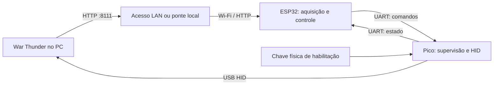

# Especificação de projeto — War Thunder HID Controller

| Campo | Definição |
| --- | --- |
| Revisão | 0.1 — especificação inicial para implementação |
| Data | 2026-09-15 |
| Arquitetura | ESP32 → UART bidirecional → Raspberry Pi Pico → USB HID → PC |
| Hardware de referência | ESP32-S3-DevKitC-1 e Raspberry Pi Pico original, RP2040 |
| Plataforma do jogo no MVP | Windows |
| Primeiro veículo | Aeronave de asa fixa; modelo e modo de controle definidos na calibração |
| Estado da validação | Projeto documental; sem ensaio físico ou piloto automático validado |

## 1. Objetivo e decisões

Construir um controlador que obtenha a telemetria HTTP do War Thunder, calcule comandos de assistência de voo no ESP32 e os envie ao Pico por UART. O Pico apresenta teclado, mouse e joystick USB ao computador e aplica os comandos enquanto a sessão estiver habilitada e válida.

O termo **datalink** designa aqui o enlace bidirecional de comandos e estado entre ESP32 e Pico. A aquisição HTTP é um subsistema separado.

Decisões desta revisão:

- Manter duas placas, conforme a arquitetura escolhida pelo usuário.
- Usar ESP32-S3 como referência de desenvolvimento; seu USB não executa o HID do jogo. Um ESP32 original poderá ser suportado por outro perfil de placa, após compilação, revisão de pinos e ensaio de memória/tempo.
- Usar o Pico original sem Wi-Fi, dedicado à UART, USB e supervisão local.
- Desenvolver firmware em C/C++, com núcleo portátil C++17 e compilação CMake.
- Entregar primeiro o transporte e o HID; depois estabilização de asas; por último manutenção de rumo e altitude.
- Assumir aeronaves para o piloto automático inicial. Controle terrestre requer outra especificação de dinâmica, sensores e critérios de aceitação.
- Preservar a possibilidade de substituir o ESP por Android, Linux ou Windows mediante o mesmo protocolo; esses aplicativos não integram o MVP.

O suporte físico a USB/UART do Pico e o exemplo HID do TinyUSB fundamentam a interface proposta. A composição e os descritores concretos serão validados no host. [Raspberry Pi](https://www.raspberrypi.com/documentation/microcontrollers/pico-series.html), [TinyUSB HID Composite](https://docs.tinyusb.org/en/latest/examples/device/hid_composite.html).

## 2. Escopo e entregáveis

### 2.1 Incluído

1. Firmware ESP: Wi-Fi, aquisição HTTP, normalização, controle, configuração e UART.
2. Firmware Pico: teclado, mouse, joystick, protocolo e desativação local independente.
3. Especificação binária UART e testes compartilhados de codificação/decodificação.
4. Simulador de enlace e reprodução de telemetria gravada no computador.
5. Perfis de aeronave com campos, sinais, limites, vínculos HID e parâmetros de controle.
6. Diagnóstico de conexão, idade dos dados, modo ativo, saturação e motivo de desativação.
7. Ponte HTTP opcional no PC, caso a porta do jogo não esteja acessível pela LAN.
8. Guia de montagem, gravação dos firmwares, calibração e operação.

### 2.2 Fora desta entrega

- Decolagem, pouso, combate, disparos ou execução autônoma de missões.
- Desvio de obstáculos e navegação por terreno.
- Force feedback, emulação XInput e recepção de teclado/mouse físicos pelo Pico.
- Aplicativos Android/Linux/Windows completos, atualização OTA e PCB própria.
- Garantia de comportamento uniforme entre aeronaves ou modos de controle.

Teclado e mouse serão implementados e testados como recursos HID. No primeiro modo de voo automático, as correções contínuas usam eixos do joystick; não há sequências automáticas de teclas de missão.

## 3. Arquitetura e responsabilidades



| Componente | Responsabilidade |
| --- | --- |
| `TelemetrySource` | Consultar endpoints, impor limites de resposta e registrar tempo de aquisição |
| `TelemetryNormalizer` | Converter campos em unidades internas e marcar disponibilidade |
| `AutopilotCore` | Calcular saída a partir de estado, objetivo, perfil e tempo decorrido |
| `ModeManager` | Controlar ativação, transições, pré-condições e falhas de telemetria |
| `Datalink` | Enquadramento, versão, sessão, sequência, confirmação e diagnóstico |
| `PicoSupervisor` | Autorizar ou interromper HID com relógio e chave locais |
| `HidOutput` | Gerar relatórios USB consistentes para cada função |

O núcleo não acessa HTTP, GPIO, UART, NVS, FreeRTOS ou TinyUSB. Recebe estruturas normalizadas e relógio monotônico fornecido pelo adaptador. Nenhuma alocação dinâmica ou espera de rede deve ocorrer dentro do passo de controle.

Interface conceitual:

```cpp
ControlOutput update(const TelemetrySnapshot& sample,
                     const PilotTargets& targets,
                     const VehicleProfile& profile,
                     float dt_seconds);
```

Estados internos, como integradores, pertencem à instância do controlador e são reinicializados em troca de perfil, sessão ou desativação. C++ é suportado pelo ESP-IDF; versões exatas de SDK, compilador, Pico SDK e TinyUSB devem ser fixadas no primeiro marco de compilação. [ESP-IDF C++](https://docs.espressif.com/projects/esp-idf/en/stable/esp32/api-guides/cplusplus.html).

## 4. Hardware e montagem

### 4.1 Lista de materiais

| Quantidade | Item | Observação |
| --- | --- | --- |
| 1 | ESP32-S3-DevKitC-1 | Wi-Fi; flash mínima de projeto de 4 MB; PSRAM não obrigatória |
| 1 | Raspberry Pi Pico / Pico H, RP2040 | USB conectado ao PC do jogo |
| 2 | Cabos USB adequados às placas | Cabo do Pico obrigatoriamente com dados |
| 1 | Chave mantida de habilitação | Ligada diretamente ao Pico |
| 1 | Resistor de 10 kΩ | Pull-up externo da entrada de habilitação |
| 1 conjunto | Protoboard/conectores e fios curtos | UART e GND, preferencialmente até 30 cm no protótipo |
| Opcional | Analisador lógico | Medição UART e latência de firmware |
| Opcional | Adaptador USB–UART TTL 3,3 V | Testar o Pico sem o ESP |

### 4.2 Ligações de referência

| Origem | Destino | Uso |
| --- | --- | --- |
| ESP GPIO17 / UART1 TX | Pico GP1 / UART0 RX, pino físico 2 | Comandos |
| Pico GP0 / UART0 TX, pino físico 1 | ESP GPIO18 / UART1 RX | Confirmações e estado |
| ESP GND | Pico GND, por exemplo pino físico 3 | Referência comum |
| Pico GP14, pino físico 19 | Chave para GND | Fechada permite habilitação; aberta desabilita |
| Pico 3V3 OUT | 10 kΩ → GP14 | Entrada permanece desabilitada com chave/fio aberto |
| Pico USB | PC do jogo | HID |

Os nomes GPIO17/18 são referentes ao ESP32-S3-DevKitC-1; conferir a revisão física antes da montagem. Não reutilizar automaticamente esses números em outra placa. [Pinagem ESP32-S3-DevKitC-1](https://docs.espressif.com/projects/esp-idf/en/v5.0/esp32s3/hw-reference/esp32s3/user-guide-devkitc-1.html), [documentação de pinagem do Pico](https://pip.raspberrypi.com/categories/610-raspberry-pi-pico).

### 4.3 Alimentação

- Alimentar cada placa pela sua entrada USB no protótipo, com capacidade para os picos de consumo do ESP durante Wi-Fi.
- Interligar somente TX, RX e GND entre placas; não unir as saídas 3V3 nem os barramentos 5V/VBUS de duas fontes.
- UART utiliza TTL 3,3 V; não conectar RS-232 nem sinal de 5 V aos GPIOs.
- Manter transmissores inativos enquanto o outro dispositivo não estiver alimentado; avaliar resistores em série/proteção contra alimentação pelos sinais na montagem definitiva.
- Uma fonte única e uma PCB poderão ser projetadas posteriormente com análise dos caminhos de alimentação.

## 5. Aquisição de telemetria

### 5.1 Acesso

Modo preferido: ESP na mesma LAN do PC, consultando uma origem HTTP configurada pelo operador. Exemplo ilustrativo: `http://192.168.1.50:8111`. O endereço real é configurável e não deve ser descoberto por varredura automática.

O acesso direto depende da interface em que o serviço escuta e das regras do firewall. `localhost` no ESP designa o próprio ESP.

Se o serviço só aceitar loopback, uma ponte no PC consulta `127.0.0.1:8111` e publica apenas os endpoints necessários em uma porta LAN dedicada. A ponte não calcula o piloto automático. Restringir acesso ao controlador e não publicar a porta na Internet.

O projeto atual contém `src/adapters/warThunderClient.ts`, reutilizável como referência para a ponte. Ele ainda não consulta `/state`. `src/server.ts` restringe Host/Origin a loopback; alterar somente o endereço de escuta não basta para oferecer acesso LAN. A ponte deve ter configuração e testes próprios.

### 5.2 Endpoints e limites

| Endpoint | Uso no projeto | Consulta inicial proposta |
| --- | --- | --- |
| `/indicators` | Atitude, rumo, identificação e instrumentos disponíveis | 10 Hz |
| `/state` | Altitude, velocidades e estado de voo disponível | 10 Hz |
| `/map_obj.json` | Posição do jogador, diagnóstico e expansão futura | 2 Hz, opcional |
| `/map_info.json` | Referência de coordenadas | 1 Hz, opcional |

Não baixar a imagem do mapa no ciclo de controle. Chat, mensagens HUD e objetos de outros jogadores não são dependências do piloto automático.

Esses endpoints e campos são documentados por observação comunitária. O contrato pode variar; `/state` pode ser inválido, especialmente fora do contexto de aeronaves. Campos ausentes não equivalem a zero. [Referência observacional da API 8111](https://github.com/CreeperUX/WT-8111-Neo/blob/main/WT_8111_API_REFERENCE.md).

As frequências acima são propostas de polling, não uma afirmação sobre a taxa nativa do jogo. Medir latência e renovação aparente dos dados em manobras controladas antes de fechar os ganhos do controlador.

Parâmetros iniciais: timeout HTTP de 300 ms; uma requisição em voo por endpoint; limite de 16 KiB por resposta crítica e 64 KiB para mapa opcional. Respostas maiores geram diagnóstico e indisponibilidade, nunca truncamento silencioso. Reutilizar conexão quando permitido. Reconexão Wi-Fi e backoff não bloqueiam UART ou supervisão.

### 5.3 Contrato interno

Cada campo tem valor, unidade definida, flag de validade e instante monotônico da aquisição. O snapshot inclui identificação da sessão local, veículo, sequência local, latência HTTP e disponibilidade por fonte.

| Campo interno | Unidade / interpretação | Necessário para |
| --- | --- | --- |
| `roll_deg` | Rolagem, sinal calibrado | Asas niveladas |
| `pitch_deg` | Arfagem, sinal calibrado | Controle de atitude/altitude |
| `heading_deg` | Rumo em [0, 360), referência calibrada | Manutenção de rumo |
| `altitude_m` | Altitude com referência explicitamente identificada | Manutenção de altitude |
| `vertical_speed_mps` | Positiva na subida após normalização | Manutenção de altitude |
| `ias_mps` | Velocidade indicada em m/s | Envelope de operação |

Não confundir IAS/TAS, rumo/proa/curso ou altitude instrumental/altura sobre terreno. Cada perfil registra a chave JSON original, conversão e evidência de calibração. Conservar amostras brutas para diagnóstico.

Rejeitar números não finitos e valores incompatíveis com o perfil. Bloquear o modo se qualquer campo obrigatório estiver indisponível. Diferença entre aquisições de campos críticos acima de 150 ms invalida o snapshot combinado. Idade máxima inicial: 500 ms desde o início da última requisição bem-sucedida correspondente.

O tempo de aquisição é um limite observável, não o timestamp de geração do jogo. JSON idêntico pode representar voo estável; não declarar congelamento apenas por igualdade de valores. Uma API que responde com dados internamente congelados, sem timestamp confiável, permanece uma limitação a registrar.

## 6. Modos de operação e controle

| Modo | Comportamento | Pré-condições |
| --- | --- | --- |
| `DISARMED` | Sem comandos ativos; telemetria e diagnóstico disponíveis | Estado inicial obrigatório |
| `MANUAL_TEST` | Ações individuais pelo operador para validar HID | Chave física, sessão e perfil de teste |
| `WINGS_LEVEL` | Corrige rolagem para objetivo zero | Rolagem e IAS válidas, envelope calibrado |
| `HEADING_HOLD` | Erro de rumo produz referência limitada de rolagem | Validação prévia de asas e rumo |
| `ALTITUDE_HOLD` | Erro de altitude produz referência limitada de subida/arfagem | Altitude, velocidade vertical, arfagem e IAS válidas |
| `HEADING_ALTITUDE_HOLD` | Combina os dois controladores com limites comuns | Ensaios independentes aprovados |

Sequência de desenvolvimento: controlador proporcional de rolagem; inclusão de amortecimento/PI/PID somente quando os dados e ensaios justificarem; malhas externas de rumo e altitude com limites de referência. Não estimar derivada de ruído sem filtro e avaliação do atraso introduzido.

Requisitos de controle:

- Erro angular pelo menor caminho, inclusive cruzamento de 359° para 0°.
- Anti-windup, saturação, limite de variação da saída e reset de integradores.
- Processar a medição com seu intervalo real; retransmitir HID a 50 Hz não transforma a telemetria em sensor de 50 Hz.
- Entrar no modo usando referências atuais quando aplicável, com transição gradual e saída limitada.
- Potência permanece manual no primeiro perfil de voo. O eixo HID de potência é testado em bancada, mas não vinculado no jogo nessa etapa.
- Desativar ao sair do envelope calibrado de IAS, atitude ou validade; recuperação exige ação do operador.
- Não definir ganhos universais. Guardar ganhos, sinais, limites e evidências por aeronave e modo de controle do jogo.

## 7. Interface USB HID do Pico

Implementar um dispositivo USB com três interfaces HID e descritores fixos na versão 1:

| Interface | Relatório proposto |
| --- | --- |
| Teclado | Modificadores + até seis teclas simultâneas; códigos HID, não texto Unicode |
| Mouse | Movimento relativo X/Y int16, roda int8 e cinco botões |
| Joystick | X/Y/Rz int16 em -32767…32767; potência uint16 em 0…32767; 32 botões; hat 0…7 e 8 neutro |

Não prometer NKRO, coordenadas absolutas de mouse, XInput ou force feedback. Usar VID/PID de desenvolvimento compatíveis com os exemplos/licenças adotados; identidade final precisa ser definida antes de distribuir o produto, sem copiar a identidade de outro fabricante.

Após conectar ou reconectar, enviar relatórios de repouso antes de aceitar ativação. Em desativação: liberar teclas, modificadores e botões; zerar deltas; centralizar X/Y/Rz; hat neutro; potência em zero conforme perfil de bancada.

**Um eixo centralizado continua sendo uma entrada de joystick.** O Pico não libera a propriedade de um eixo do jogo como libera uma tecla. A retomada manual e a coexistência com outro controle devem ser verificadas no perfil. Potência zero não é uma condição neutra de voo; manter esse vínculo desabilitado no MVP aéreo.

O Pico não conhece o foco da janela e não observa o teclado físico do operador. A chave local é a interrupção independente. Desativar antes de trocar de janela; não especificar pausa automática por foco sem um agente adicional no PC.

## 8. Protocolo UART v1

### 8.1 Transporte e enquadramento

- 115200 baud, 8 bits, sem paridade, 1 stop bit, full duplex, sem RTS/CTS no protótipo.
- UART dedicada: logs nunca compartilham o fluxo binário.
- Corpo serializado explicitamente em little-endian, enquadrado por COBS e terminado por byte `0x00`.
- Cabeçalho de 16 bytes, payload de até 96 bytes e CRC de 2 bytes: máximo de 114 bytes decodificados e 116 bytes no fio.
- Buffer receptor de quadro de 128 bytes; em overflow, descartar até o próximo delimitador. Quadro parcial sem concluir em 100 ms é descartado.
- CRC-16/CCITT-FALSE: polinômio 0x1021, inicial 0xFFFF, sem reflexão, xor final 0; calculado sobre cabeçalho + payload, antes do COBS; CRC transmitido little-endian. Vetor de referência ASCII `123456789` → 0x29B1.

| Offset | Campo | Tipo |
| --- | --- | --- |
| 0 | `version`, valor 1 | u8 |
| 1 | `message_type` | u8 |
| 2 | `payload_length` | u16 |
| 4 | `session_id` | u64 |
| 12 | `sequence` | u32 |
| 16 | Payload | bytes |
| 16 + tamanho | CRC | u16 |

Cada emissor mantém sua sequência global por sessão, iniciando em 1 e crescente; abrir nova sessão antes de atingir o limite u32. Duplicatas nunca reaplicam movimentos ou ações; números inferiores são descartados. Validação de comprimento, versão, sessão, CRC e campos precede qualquer efeito.

### 8.2 Mensagens

Os tipos abaixo constituem o contrato inicial. Campos estão listados em ordem de serialização, sem padding; `u8/u16/u32/u64` são inteiros sem sinal, `i8/i16` com sinal.

| ID | Nome / direção | Payload |
| --- | --- | --- |
| 0x01 | `HELLO`, ESP → Pico | `capabilities_requested:u32` |
| 0x02 | `CAPABILITIES`, Pico → ESP | `supported:u32, max_payload:u16, control_timeout_ms:u16, firmware_major:u16, firmware_minor:u16` |
| 0x03 | `ARM`, ESP → Pico | `profile_id:u32, profile_revision:u32, mode:u8` |
| 0x04 | `DISARM`, ESP → Pico | `reason:u8` |
| 0x05 | `SET_CONTROLS`, ESP → Pico | `roll:i16, pitch:i16, yaw:i16, throttle:u16, buttons:u32, hat:u8, modifiers:u8, keys:u8[6], mouse_buttons:u8` |
| 0x06 | `MOUSE_DELTA`, ESP → Pico | `dx:i16, dy:i16, wheel:i8` |
| 0x07 | `HEARTBEAT`, ESP → Pico | `mode:u8, telemetry_valid:u8, telemetry_age_ms:u16` |
| 0x08 | `STATUS`, Pico → ESP | `state:u8, reason:u8, last_received_seq:u32, last_applied_control_seq:u32, control_age_ms:u16, switch_enabled:u8, usb_mounted:u8, crc_errors:u32, framing_errors:u32` |
| 0x09 | `ACK`, Pico → ESP | `request_sequence:u32, result:u8` |

Bits de capacidade 0/1/2 = teclado/mouse/joystick; bits restantes reservados e zero. Modos de ARM: 1=teste, 2=asas, 3=rumo, 4=altitude, 5=rumo+altitude. Estados: 0=USB indisponível, 1=desarmado, 2=pronto, 3=armado, 4=falha. Resultados ACK: 0=OK, 1=incompatível, 2=estado inválido, 3=perfil inválido, 4=payload inválido. Motivos: 0=nenhum, 1=operador, 2=chave, 3=USB, 4=timeout de controle, 5=telemetria, 6=sessão, 7=perfil, 8=erro interno.

`SET_CONTROLS` tem 21 bytes de payload e representa estado completo. `MOUSE_DELTA` é um evento não repetível. Cliques são transições de estado dos botões em dois ou mais snapshots; a fila do host deve preservar a duração mínima configurada durante testes.

### 8.3 Sessão e entrega

1. ESP cria `session_id` aleatório não zero, limpa filas e envia HELLO.
2. HELLO sempre desarma o Pico e limpa estados, sequências e deltas anteriores; CAPABILITIES ecoa a sessão recebida. HELLO idêntico pode ser reenviado durante o handshake, nunca durante operação armada.
3. ESP valida recursos e perfil. Pico só aceita ARM após uma abertura e fechamento da chave observados nessa sessão, USB montado e perfil local conhecido.
4. ARM é confirmado por ACK. O host não transmite controles ativos antes do ACK. Perda/timeout do ACK de ARM exige novo handshake, sem repetição tardia de ARM na sessão anterior.
5. `SET_CONTROLS` é enviado a 50 Hz com sequência nova; o Pico aplica o estado mais recente. `MOUSE_DELTA` não é retransmitido; no MVP limitado a 20 Hz em teste manual.
6. STATUS a 10 Hz e após mudança de estado; HEARTBEAT a 10 Hz. ARM/DISARM recebem ACK; snapshots não recebem ACK individual.
7. DISARM é idempotente e pode ser reenviado. Perfil ou modo não muda enquanto armado: desarmar e iniciar novo handshake.

No Pico, `profile_id/revision` seleciona uma configuração conhecida que limita recursos permitidos; o primeiro perfil aéreo permite apenas X/Y/Rz e bloqueia teclado, mouse e potência ativa. Perfis desconhecidos impedem ARM. O firmware deve rejeitar qualquer payload fora desses limites sem atualizar o prazo de validade do controle.

CAPABILITIES, ACK e STATUS usam a sequência própria do Pico; o campo `request_sequence` referencia a sequência do ESP. CRC detecta corrupção, não autentica o emissor; o enlace físico do protótipo é considerado confiável.

Com 21 bytes de payload, SET_CONTROLS ocupa até 41 bytes no fio: 50 Hz resulta em aproximadamente 20,5 kbit/s em 8N1. Há margem em 115200 baud para heartbeat e teste de mouse; STATUS trafega na direção oposta. Medir utilização e manter abaixo de 50% por direção no cenário suportado.

## 9. Supervisão e temporização

| Parâmetro | Valor inicial / requisito |
| --- | --- |
| Ciclo de controle e envio de snapshot ESP | 20 ms / 50 Hz |
| Timeout sem SET_CONTROLS válido no Pico | 250 ms |
| Validade máxima de campo crítico no ESP | 500 ms conforme aquisição definida na seção 5 |
| Idade sem STATUS no ESP | 500 ms → parar envio ativo e desativar |
| Abertura da chave → solicitação de HID de repouso | Meta de até 20 ms com firmware operante |
| Quadro completo válido → relatório USB submetido | Meta p95 ≤ 20 ms, host montado |
| Watchdog de hardware | Meta inicial 500 ms; alimentar apenas com progresso das tarefas críticas |

São metas de projeto, não medições. Latência até a reação da aeronave inclui polling, rede, processamento do jogo e USB e deve ser medida separadamente.

Regras obrigatórias:

- Inicialização, reset, nova sessão e reconexão USB sempre desarmados.
- Heartbeat sozinho não renova o timeout de SET_CONTROLS.
- Em modo de voo, HEARTBEAT com telemetria inválida ou idade acima do limite desarma o Pico. A verificação principal de campos ocorre no ESP antes de produzir comandos. MANUAL_TEST dispensa telemetria, mas mantém chave, sessão, perfil e timeout de SET_CONTROLS obrigatórios.
- Quadro inválido não atualiza temporizadores. Perda de dados válidos termina em timeout.
- Detectada telemetria inválida no ESP durante modo de voo: cessar comandos ativos e enviar DISARM; se o pacote se perder, prevalece o timeout local do Pico.
- Abertura da chave e falhas têm prioridade sobre UART/HID normal. Exigir abertura estável de 20 ms para liberar uma nova tentativa; fechamento estável de 30 ms para permitir ARM. Uma abertura bruta já solicita desativação.
- Após falha, exigir nova sessão e novo ciclo da chave; nunca rearmar por reconexão automática.
- Limpar deltas, snapshots pendentes e integradores ao desativar.

Se o USB estiver desconectado, não é possível enviar liberações ao host; limpar o estado local e enviar repouso após a próxima enumeração. Se a CPU do Pico travar, a chave lida por software depende da recuperação pelo watchdog; não descrevê-la como corte elétrico independente.

## 10. Organização dos firmwares e configuração

ESP: tarefas separadas para aquisição HTTP, controle/modos, UART e configuração/diagnóstico. Comunicação por snapshots imutáveis e filas limitadas. HTTP e logs têm prioridade inferior ao enlace. Publicar somente o snapshot mais recente, sem crescimento ilimitado de fila.

Pico: loop cooperativo C/C++ com TinyUSB, recepção UART por interrupção/ring buffer e supervisão frequente. Uma única entidade altera o estado HID. Não usar `sleep` bloqueante para duração de teclas; agendar transições.

Configuração inicial por console de manutenção do ESP, com persistência em NVS e validação de esquema. Campos: origem HTTP, credenciais Wi-Fi, perfil, revisão, limites, referências de voo e parâmetros de diagnóstico. Não imprimir senhas. Alterações de perfil/origem somente desarmado. Painel web embarcado é evolução opcional.

Registrar: build dos dois firmwares, perfil/revisão, modo, motivo de desativação, latência/idade HTTP, erro de controle, saturação, sequências e erros UART. Escritas persistentes são agrupadas e fora do ciclo crítico; gravação contínua ocorre preferencialmente no computador de teste.

## 11. Organização futura do repositório

Pasta sugerida: `C:\WSLD\WarThunder-HID-Controller`. Esta revisão documental fica no repositório atual; a criação do novo repositório e os firmwares pertencem à implementação.

```text
WarThunder-HID-Controller/
├── core/                  # Modelos, modos e controle C++17
├── protocol/              # Especificação v1, codec e vetores de referência
├── firmware/
│   ├── esp32/             # ESP-IDF e adaptadores
│   └── pico/              # Pico SDK, TinyUSB e supervisor
├── profiles/              # Aeronaves, controles e limites versionados
├── bridge/                # Ponte opcional da telemetria
├── simulator/             # Host UART e reprodução de telemetria
├── tests/                 # Core, protocolo e integração simulada
├── docs/                  # Montagem, operação e resultados de ensaio
└── README.md
```

O codec deve compilar no ESP, Pico e host. O núcleo deve compilar no ESP e host sem headers específicos de placa. Não se exige uma interface gráfica compartilhada para preservar essa portabilidade.

## 12. Requisitos verificáveis

| ID | Requisito | Evidência de aceitação |
| --- | --- | --- |
| RF-01 | Enumerar teclado, mouse e joystick | Inspeção dos descritores e eventos no Windows |
| RF-02 | Aplicar comandos UART válidos | Captura serial correlacionada a relatórios HID |
| RF-03 | Rejeitar corrupção, duplicatas e sessão antiga | Injeção determinística e ausência de efeitos HID |
| RF-04 | Interromper por chave e timeout | Medição conforme seção 9 |
| RF-05 | Recuperar sem rearmar automaticamente | Reset de cada placa e reconexões com chave aberta/fechada |
| RF-06 | Normalizar dados e bloquear campos ausentes | Fixtures com ausência, NaN, unidades distintas e valid:false |
| RF-07 | Manter Wi-Fi bloqueado sem paralisar Pico/UART | Falha HTTP durante operação de bancada |
| RF-08 | Executar núcleo no host e ESP | Mesma gravação, saídas comparadas com tolerância numérica declarada |
| RF-09 | Permitir retomada manual verificável | Ensaio dos vínculos do jogo e desativação física |
| RF-10 | Sustentar cada modo de voo habilitado | Logs e critérios da seção 13 por perfil |

## 13. Plano de implementação e aceitação

### M0 — Compilação e montagem

Fixar SDKs, toolchains e versões; confirmar modelo das placas, pinagem e alimentação. Compilar firmware mínimo para ambos e núcleo/codec no host. Saída: builds reproduzíveis e registro de bancada.

### M1 — HID isolado

Pico controlado por simulador UART no PC. Validar seis teclas, modificadores, mouse relativo, roda, botões, limites de eixos e hat. Executar ativação/desativação e 100 ciclos de conexão USB sem entrada ativa após reconexão. Testar em aplicativo de captura de entradas.

### M2 — Datalink completo

Conectar ESP e Pico. Testar perda de delimitador, CRC incorreto, comprimentos excessivos, fragmentação, sequência duplicada/antiga, sessão antiga, ACK perdido, reset e overflow. Verificar que um delta de mouse duplicado não se repete. Testar limites de tempo com analisador ou timestamps instrumentados.

Ensaiar enlace por 60 minutos com Wi-Fi ativo: nenhuma entrada indevida, nenhum crescimento contínuo de memória e metas de latência/timeout atendidas. Contadores devem refletir falhas injetadas.

### M3 — Telemetria sem atuação

Capturar dados reais da aeronave escolhida, com manobras manuais conhecidas, em ambiente de teste controlado. Medir latências p50/p95/p99, campos, sinais, unidades, renovação aparente, modo do jogo e limites de resposta. Confirmar acesso LAN ou necessidade da ponte.

Saída: perfil calibrado, gravações brutas, relatório e decisão documentada sobre quais modos têm dados suficientes. Disponibilidade de HTTP não aprova automaticamente controle fechado.

### M4 — Asas niveladas

Validar vínculo dos eixos e retomada manual. Começar em voo estável e dentro de envelope conservador. Meta inicial a verificar: após perturbações de rolagem de ±10°, atingir erro absoluto ≤5° em até 10 s e mantê-lo por 60 s, sem oscilação crescente nem saturação por mais de 2 s contínuos. Executar três repetições por sentido.

Se os limites não forem compatíveis com a aeronave/telemetria, registrar a revisão dos critérios antes da aprovação, mantendo os resultados originais. Não aumentar ganhos apenas para compensar atraso de rede.

### M5 — Rumo e altitude

Ensaiar cada modo isoladamente, depois em conjunto. Metas iniciais por perfil: degrau de rumo de ±10° atingir erro ≤5° em até 30 s; degrau de altitude de ±50 m atingir erro ≤20 m em até 60 s; manter a faixa por 60 s sem sair do envelope. Potência ajustada manualmente. Três repetições por direção.

Registrar condições, aeronave, modo do jogo, ganhos, limites, overshoot, saturação e latência. Testar perda de rede, telemetria inválida e chave durante os ensaios. Esses números são critérios candidatos de engenharia, sem promessa de desempenho antes da medição.

### M6 — Entrega operacional

Entregar firmwares versionados, procedimento de gravação, perfil aprovado, protocolo, simulador, esquema de montagem e relatório de testes. Concluir operação de 60 minutos com o perfil aprovado e demonstrar recuperação controlada de falhas. Só declarar os modos aprovados pelos marcos anteriores.

## 14. Limitações e decisões pendentes de bancada

| Questão | Tratamento nesta revisão |
| --- | --- |
| Placa ESP já disponível não informada | Referência S3; adaptar somente o perfil de hardware se necessário |
| Aeronave e modo do jogo não escolhidos | Selecionar no M3; nenhuma configuração universal presumida |
| Taxa real e completude da telemetria | Medir antes de habilitar controle fechado |
| Servidor 8111 inacessível por LAN | Usar ponte opcional no PC |
| Dados congelados sem timestamp do jogo | Limitação observável; não alegar detecção completa |
| Conflito de eixos e Instructor/mouse aim | Validar vínculos e modo antes do M4 |
| Foco da janela indisponível | Desativação explícita; suporte a foco requer outro componente |
| Controle de potência e retomada manual | Fora da malha automática inicial |

## 15. Referências consultadas

- [Raspberry Pi: família Pico e interfaces](https://www.raspberrypi.com/documentation/microcontrollers/pico-series.html).
- [Raspberry Pi: documentos e pinagem do Pico original](https://pip.raspberrypi.com/categories/610-raspberry-pi-pico).
- [Espressif: ESP32-S3-DevKitC-1 v1.1](https://docs.espressif.com/projects/esp-idf/en/v5.0/esp32s3/hw-reference/esp32s3/user-guide-devkitc-1.html).
- [Espressif: UART do ESP32-S3](https://docs.espressif.com/projects/esp-idf/en/stable/esp32s3/api-reference/peripherals/uart.html).
- [Espressif: suporte C++](https://docs.espressif.com/projects/esp-idf/en/stable/esp32/api-guides/cplusplus.html).
- [TinyUSB: exemplo HID Composite](https://docs.tinyusb.org/en/latest/examples/device/hid_composite.html).
- [API 8111: observações comunitárias de endpoints e campos](https://github.com/CreeperUX/WT-8111-Neo/blob/main/WT_8111_API_REFERENCE.md).

As decisões de protocolo, limites, taxas e critérios de ensaio deste documento são propostas do projeto. As fontes fundamentam capacidades de hardware/software e observações de telemetria; não validam o desempenho do piloto automático.
